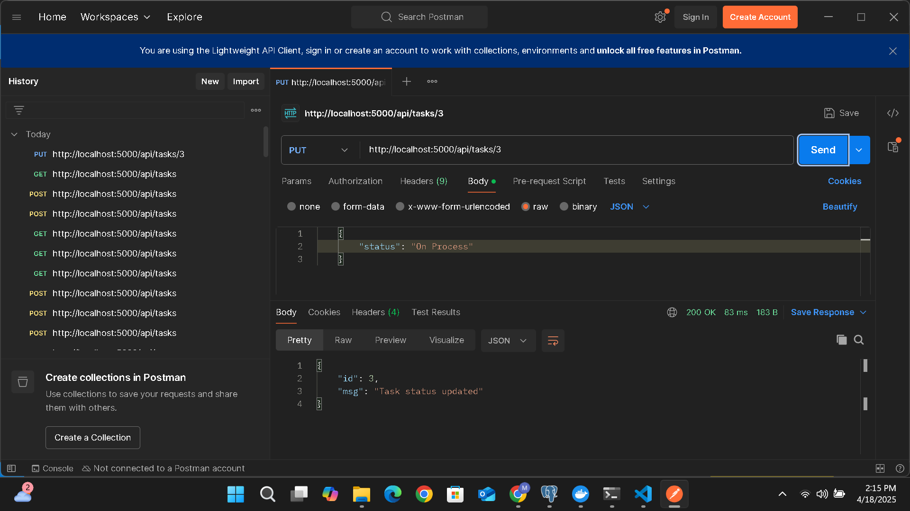

## 📄 Laporan Week 10

### 👥 Anggota Tim
1. **Muhammad Syahril Faizal** – 10221035
2. **Hardi Wira Pratama** - 10221049
3. **Faiq Athari** - 10221052


<br>

## Membuat layanan Backend terpisah menggunakan flask

## 1. `tasks.py`
```python

    import psycopg2
    import os
    from flask import Blueprint, request, jsonify
    from .utils import get_db_connection

    task_bp = Blueprint('tasks', __name__)

    # Endpoint to get all tasks
    @task_bp.route('/', methods=['GET'])
    def get_tasks():
        conn = get_db_connection()
        cur = conn.cursor()
        cur.execute("SELECT id, name, description, due_date, priority, status, assignee_id FROM tasks;")
        rows = cur.fetchall()
        cur.close()
        conn.close()

        tasks = [{"id": row[0], "name": row[1], "description": row[2], "due_date": row[3], "priority": row[4], "status": row[5], "assignee_id": row[6]} for row in rows]
        return jsonify(tasks)

    # Endpoint to create a new task
    @task_bp.route('/', methods=['POST'])
    def create_task():
        data = request.json
        name = data['name']
        description = data['description']
        due_date = data['due_date']
        priority = data['priority']
        assignee_id = data['assignee_id']

        conn = get_db_connection()
        cur = conn.cursor()
        cur.execute("INSERT INTO tasks (name, description, due_date, priority, status, assignee_id) VALUES (%s, %s, %s, %s, %s, %s) RETURNING id;",
                    (name, description, due_date, priority, 'Pending', assignee_id))
        new_id = cur.fetchone()[0]
        conn.commit()
        cur.close()
        conn.close()

        return jsonify({"id": new_id, "name": name, "description": description, "due_date": due_date, "priority": priority, "status": 'Pending', "assignee_id": assignee_id}), 201

    # Endpoint to update task status
    @task_bp.route('/<int:task_id>', methods=['PUT'])
    def update_task_status(task_id):
        data = request.json
        status = data['status']

        conn = get_db_connection()
        cur = conn.cursor()
        cur.execute("UPDATE tasks SET status = %s WHERE id = %s RETURNING id;", (status, task_id))
        updated_id = cur.fetchone()[0]
        conn.commit()
        cur.close()
        conn.close()

        return jsonify({"msg": "Task status updated", "id": updated_id}), 200

```
## API Endpoints

### 1. `GET /api/tasks/`
- **Fungsi**: Mengambil semua task dari database.
- **Metode**: `GET`
- **Deskripsi**: Menampilkan semua task yang ada, termasuk nama, deskripsi, tanggal jatuh tempo, prioritas, status, dan ID assignee.

### 2. `POST /api/tasks/`
- **Fungsi**: Membuat task baru.
- **Metode**: `POST`
- **Deskripsi**: Menerima data task baru seperti nama, deskripsi, tanggal jatuh tempo, prioritas, dan assignee_id, kemudian menyimpannya dalam database dengan status "Pending".

### 3. `PUT /api/tasks/<int:task_id>`
- **Fungsi**: Memperbarui status task.
- **Metode**: `PUT`
- **Deskripsi**: Memperbarui status task berdasarkan `task_id` yang diberikan, seperti mengubah status menjadi "Completed" atau "In Progress".

<br>

## 2. `users.py`

```python
    import psycopg2
    import os
    from flask import Blueprint, request, jsonify
    from .utils import get_db_connection

    user_bp = Blueprint('users', __name__)

    # Endpoint to create a new user
    @user_bp.route('/', methods=['POST'])
    def create_user():
        data = request.json
        username = data['username']
        password = data['password']  # In a real application, don't store plain passwords, hash them!

        conn = get_db_connection()
        cur = conn.cursor()
        cur.execute("INSERT INTO users (username, password) VALUES (%s, %s) RETURNING id;", (username, password))
        new_id = cur.fetchone()[0]
        conn.commit()
        cur.close()
        conn.close()

        return jsonify({"id": new_id, "username": username, "password": password}), 201

```
## 2. API Endpoint: `POST /api/users/`

### Fungsi
- **Tujuan**: Membuat pengguna baru dalam sistem.

### Proses
1. **Menerima Data**: Menggunakan metode `POST` untuk menerima data JSON yang berisi `username` dan `password` dari client.
2. **Menyimpan Data**: Data yang diterima kemudian disimpan ke dalam tabel `users` di database PostgreSQL menggunakan query `INSERT`.
3. **Mendapatkan ID Baru**: Setelah data berhasil disimpan, query `RETURNING id` digunakan untuk mendapatkan ID pengguna yang baru dibuat.
4. **Mengembalikan Response**: Mengembalikan respons dalam format JSON yang berisi `id`, `username`, dan `password` pengguna yang baru dibuat.

<br>

## Membuat Skema Database
### 1. `schema.sql`
```sql
    CREATE TABLE users (
        id SERIAL PRIMARY KEY,
        username VARCHAR(100) UNIQUE NOT NULL,
        password VARCHAR(255) NOT NULL
    );

    CREATE TABLE tasks (
        id SERIAL PRIMARY KEY,
        name VARCHAR(255) NOT NULL,
        description TEXT,
        due_date DATE,
        priority VARCHAR(50),
        status VARCHAR(50) DEFAULT 'Pending',
        assignee_id INTEGER REFERENCES users(id)
    );
```
## Penjelasan Schema SQL

### 1. Tabel `users`
- **Tujuan**: Menyimpan data pengguna (user).
- **Kolom**:
  - `id`: Kolom ini adalah **primary key** dengan tipe data `SERIAL` yang secara otomatis menghasilkan nilai unik untuk setiap pengguna baru.
  - `username`: Menyimpan nama pengguna (username) dengan panjang maksimal 100 karakter, bersifat **unik** (tidak boleh ada dua pengguna dengan username yang sama) dan tidak boleh kosong (not null).
  - `password`: Menyimpan password pengguna dengan panjang maksimal 255 karakter dan tidak boleh kosong (not null).
  
### 2. Tabel `tasks`
- **Tujuan**: Menyimpan data tugas (task) yang terkait dengan pengguna.
- **Kolom**:
  - `id`: Kolom ini adalah **primary key** dengan tipe data `SERIAL` yang menghasilkan nilai unik secara otomatis untuk setiap task baru.
  - `name`: Menyimpan nama tugas dengan panjang maksimal 255 karakter dan tidak boleh kosong (not null).
  - `description`: Menyimpan deskripsi tugas dalam format teks (text), yang sifatnya opsional.
  - `due_date`: Menyimpan tanggal jatuh tempo tugas (dengan tipe data `DATE`), opsional.
  - `priority`: Menyimpan tingkat prioritas tugas (misalnya `High`, `Medium`, `Low`) dengan panjang maksimal 50 karakter, opsional.
  - `status`: Menyimpan status tugas dengan nilai default 'Pending' (misalnya `Pending`, `In Progress`, `Completed`).
  - `assignee_id`: Kolom ini merujuk ke kolom `id` di tabel `users`. **Foreign key** ini menandakan siapa yang ditugaskan untuk tugas tersebut, dan harus ada pengguna yang valid dengan ID yang sesuai di tabel `users`.

### Relasi antara Tabel
- Tabel `tasks` memiliki **foreign key** `assignee_id` yang merujuk pada kolom `id` di tabel `users`. Ini memungkinkan untuk menghubungkan setiap tugas dengan pengguna tertentu (assignee).

<br>

## Membuat Dockerfile
### 1. `Dockerfile`
```Dockerfile

FROM python:3.8-slim

RUN apt-get update && apt-get install -y \
    gcc \
    libpq-dev \
    netcat-openbsd \
    && rm -rf /var/lib/apt/lists/*

WORKDIR /app


COPY services/requirements.txt .
RUN pip install -r requirements.txt


COPY services /app

COPY wait-for-it.sh /wait-for-it.sh
RUN chmod +x /wait-for-it.sh

ENV FLASK_APP=/app/app.py

CMD sleep 10 && flask run --host=0.0.0.0 --port=5000

```

## Penjelasan Dockerfile

### 1. **Menggunakan Image Dasar Python**
```dockerfile
FROM python:3.8-slim
```
### 2. **Menginstal Dependensi Sistem**
```dockerfile
RUN apt-get update && apt-get install -y \
    gcc \
    libpq-dev \
    netcat-openbsd \
    && rm -rf /var/lib/apt/lists/*
```
### 3. **Mengatur Direktori Kerja**
```dockerfile
WORKDIR /app
```
### 4. Menyalin dan Menginstal Dependensi Python
```dockerfile
COPY services/requirements.txt .
RUN pip install -r requirements.txt
```
### 5. Menyalin kode aplikasi
```
COPY services /app
```
### 6. Menetapkan aplikasi Flask
```dockerfile
ENV FLASK_APP=/app/app.py
```
### 7. Menjalankan aplikasi Flask
```dockerfile
CMD sleep 10 && flask run --host=0.0.0.0 --port=5000
```

<br>
<br>

## Mengetes tiap Endpoint API

## 1. Mengetes `API/users` method `GET`


## 1. Mengetes `API/tasks` method `POST`


## 1. Mengetes `API/tasks` method `GET`


## 1. Mengetes `API/tasks` method `PUT`
