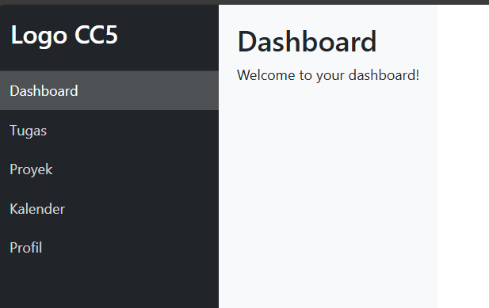
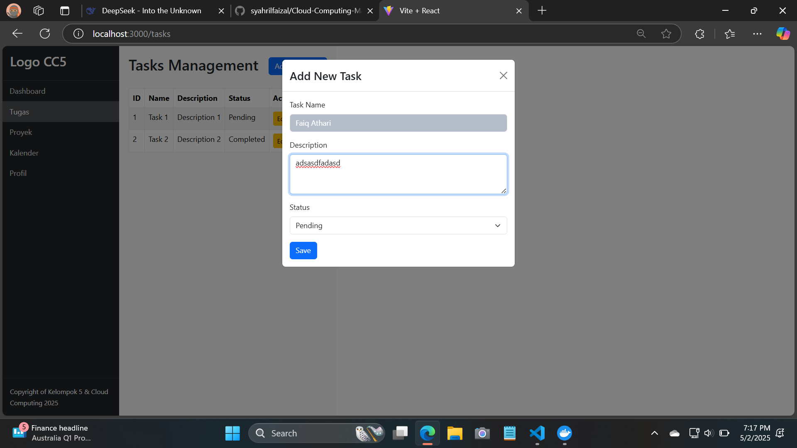
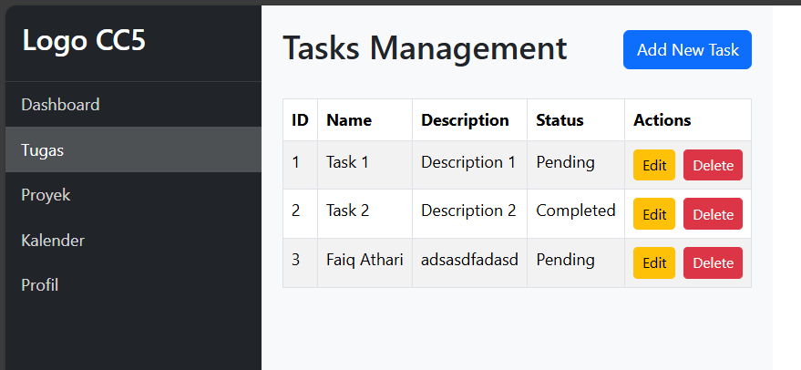
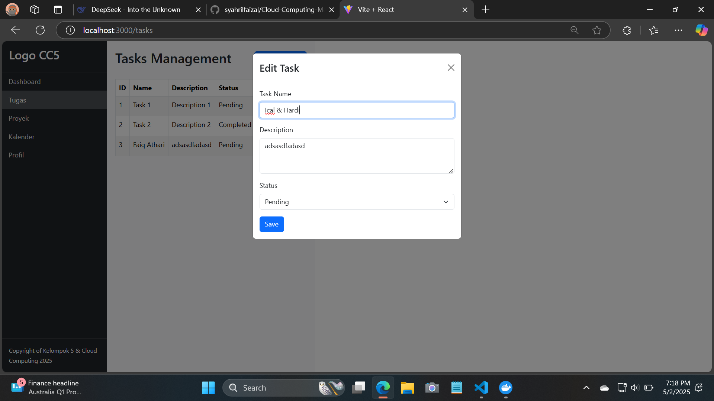
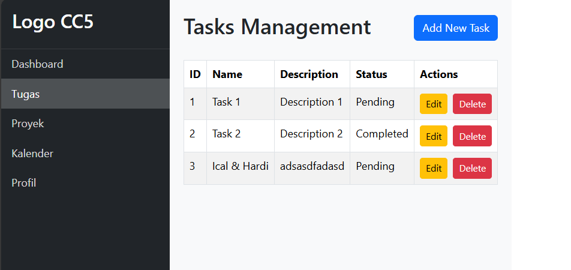
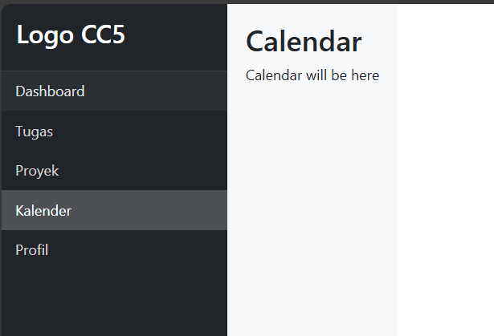
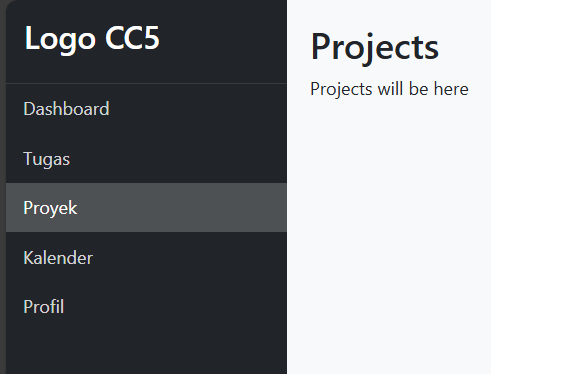
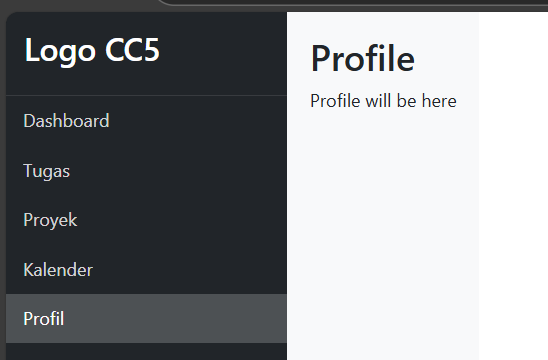

## 📄 Laporan Week 11

### 👥 Anggota Tim
1. **Muhammad Syahril Faizal** – 10221035
2. **Hardi Wira Pratama** - 10221049
3. **Faiq Athari** - 10221052

<br>

# Laporan Deployment Frontend React + Vite dengan Docker

## 1. Inisialisasi Proyek
```bash
# Buat folder frontend
mkdir frontend
cd frontend

# Buat project React + Vite
npm create vite@latest my-react-app -- --template react
cd my-react-app
```

## 2. Instalasi Dependencies
```bash
npm install react-router-dom react-bootstrap bootstrap
```

## 3. Struktur File Komponen
```
src/
├── Dockerfile
├── nginx.conf
└── my-react-app/
    ├── src/
        ├── components/
            ├── Dashboard.jsx
            ├── Tasks.jsx
            ├── Users.jsx
            ├── Profile.jsx
            ├── Projects.jsx
            └── Calendar.jsx
        ├── App.jsx
        └── App.css
    ├── package.json
    └── vite.config.js
```

## 4. Membuat Dashboard

### 1. App.jsx
```jsx
import { useState } from 'react';
import { BrowserRouter as Router, Routes, Route, Link } from 'react-router-dom';
import 'bootstrap/dist/css/bootstrap.min.css';
import './App.css';

// Components
import Dashboard from './components/Dashboard';
import Users from './components/Users';
import Tasks from './components/Tasks';
import Projects from './components/Projects';
import Calendar from './components/Calendar';
import Profile from './components/Profile';

function App() {
  const [activeTab, setActiveTab] = useState('dashboard');

  return (
    <Router>
      <div className="app-container">
        {/* Sidebar */}
        <div className="sidebar bg-dark text-white">
          <div className="sidebar-header p-3">
            <h3>Logo CC5</h3>
          </div>
          <ul className="nav flex-column">
            <li className="nav-item">
              <Link 
                to="/" 
                className={`nav-link ${activeTab === 'dashboard' ? 'active' : ''}`}
                onClick={() => setActiveTab('dashboard')}
              >
                Dashboard
              </Link>
            </li>
            <li className="nav-item">
              <Link 
                to="/tasks" 
                className={`nav-link ${activeTab === 'tasks' ? 'active' : ''}`}
                onClick={() => setActiveTab('tasks')}
              >
                Tugas
              </Link>
            </li>
            <li className="nav-item">
              <Link 
                to="/projects" 
                className={`nav-link ${activeTab === 'projects' ? 'active' : ''}`}
                onClick={() => setActiveTab('projects')}
              >
                Proyek
              </Link>
            </li>
            <li className="nav-item">
              <Link 
                to="/calendar" 
                className={`nav-link ${activeTab === 'calendar' ? 'active' : ''}`}
                onClick={() => setActiveTab('calendar')}
              >
                Kalender
              </Link>
            </li>
            <li className="nav-item">
              <Link 
                to="/profile" 
                className={`nav-link ${activeTab === 'profile' ? 'active' : ''}`}
                onClick={() => setActiveTab('profile')}
              >
                Profil
              </Link>
            </li>
          </ul>
          <div className="sidebar-footer p-3">
            <small>Copyright of Kelompok 5 & Cloud Computing 2025</small>
          </div>
        </div>

        {/* Main Content */}
        <div className="main-content">
          <Routes>
            <Route path="/" element={<Dashboard />} />
            <Route path="/users" element={<Users />} />
            <Route path="/tasks" element={<Tasks />} />
            <Route path="/projects" element={<Projects />} />
            <Route path="/calendar" element={<Calendar />} />
            <Route path="/profile" element={<Profile />} />
          </Routes>
        </div>
      </div>
    </Router>
  );
}

export default App;
```

#### Penjelasan App.jsx

##### 1. **Impor Modul**
```jsx
import { useState } from 'react';
import { BrowserRouter as Router, Routes, Route, Link } from 'react-router-dom';
import 'bootstrap/dist/css/bootstrap.min.css';
import './App.css';
```
- **`useState`**: Hook React untuk manajemen state
- **`react-router-dom`**: Untuk routing/navigasi antar komponen
- **`bootstrap`**: Framework CSS untuk styling
- **`App.css`**: File CSS kustom

---

##### 2. **Impor Komponen**
```jsx
import Dashboard from './components/Dashboard';
import Users from './components/Users';
import Tasks from './components/Tasks';
import Projects from './components/Projects';
import Calendar from './components/Calendar';
import Profile from './components/Profile';
```
Mengimpor 6 komponen halaman yang akan ditampilkan di route berbeda.

---

##### 3. **Komponen Utama `App`**
```jsx
function App() {
  const [activeTab, setActiveTab] = useState('dashboard');
```
- **`activeTab`**: State untuk melacak tab/link yang aktif
- **`setActiveTab`**: Fungsi untuk mengupdate state

---

##### 4. **Struktur Layout**
###### a. **Router Wrapper**
```jsx
<Router>
  {/* Konten aplikasi */}
</Router>
```
Membungkus seluruh aplikasi dengan sistem routing.

###### b. **Sidebar**
```jsx
<div className="sidebar bg-dark text-white">
  {/* Logo */}
  <div className="sidebar-header p-3">
    <h3>Logo CC5</h3>
  </div>

  {/* Navigasi */}
  <ul className="nav flex-column">
    <li className="nav-item">
      <Link 
        to="/" 
        className={`nav-link ${activeTab === 'dashboard' ? 'active' : ''}`}
        onClick={() => setActiveTab('dashboard')}
      >
        Dashboard
      </Link>
    </li>
    {/* Item navigasi lainnya sama struktur */}
  </ul>

  {/* Footer */}
  <div className="sidebar-footer p-3">
    <small>Copyright of Kelompok 5 & Cloud Computing 2025</small>
  </div>
</div>
```
- Menggunakan Bootstrap classes (`bg-dark`, `text-white`, dll)
- Setiap `Link`:
  - `to`: menentukan route tujuan
  - `className`: conditional styling berdasarkan `activeTab`
  - `onClick`: update state saat diklik

###### c. **Main Content**
```jsx
<div className="main-content">
  <Routes>
    <Route path="/" element={<Dashboard />} />
    <Route path="/users" element={<Users />} />
    <Route path="/tasks" element={<Tasks />} />
    {/* Route lainnya */}
  </Routes>
</div>
```
- **`Routes`**: Container untuk semua route
- **`Route`**: 
  - `path`: URL path
  - `element`: Komponen yang akan dirender

---

##### 5. **Mekanisme Kerja**
1. Saat pengguna mengklik link di sidebar:
   - `activeTab` diupdate via `setActiveTab`
   - Router mengarahkan ke komponen yang sesuai
   - Class `active` ditambahkan ke link yang aktif

2. Setiap komponen halaman:
   - Dirender secara dinamis di area `main-content`
   - Mempertahankan state sidebar yang aktif

---

##### 6. **Fitur Kunci**
- **Routing Client-side**: Navigasi tanpa reload halaman
- **Active State**: Visual feedback untuk menu aktif
- **Responsive Design**: Layout sidebar + main content
- **Modular**: Setiap halaman sebagai komponen terpisah

---

##### 7. **Dependencies**
- `react-router-dom@6`: Untuk routing
- `bootstrap@5`: Untuk styling dasar
- CSS kustom: Untuk layout spesifik


### 2. App.css
```css
body {
  margin: 0;
  font-family: -apple-system, BlinkMacSystemFont, 'Segoe UI', 'Roboto', 'Oxygen',
    'Ubuntu', 'Cantarell', 'Fira Sans', 'Droid Sans', 'Helvetica Neue',
    sans-serif;
}

.app-container {
  display: flex;
  min-height: 100vh;
}

.sidebar {
  width: 250px;
  min-height: 100vh;
  display: flex;
  flex-direction: column;
}

.sidebar-header {
  border-bottom: 1px solid rgba(255, 255, 255, 0.1);
}

.sidebar-footer {
  margin-top: auto;
  border-top: 1px solid rgba(255, 255, 255, 0.1);
}

.main-content {
  flex: 1;
  padding: 20px;
  background-color: #f8f9fa;
}

.nav-link {
  color: rgba(255, 255, 255, 0.8);
  padding: 10px 15px;
  transition: all 0.3s;
}

.nav-link:hover {
  color: white;
  background-color: rgba(255, 255, 255, 0.1);
}

.nav-link.active {
  color: white;
  background-color: rgba(255, 255, 255, 0.2);
}
```

#### Penjelasan App.css

##### 1. **Reset Dasar**
```css
body {
  margin: 0;
  font-family: -apple-system, BlinkMacSystemFont, 'Segoe UI', 'Roboto', 'Oxygen',
    'Ubuntu', 'Cantarell', 'Fira Sans', 'Droid Sans', 'Helvetica Neue',
    sans-serif;
}
```
- **`margin: 0`**: Menghilangkan margin default body
- **`font-family`**: Menggunakan sistem font stack modern untuk konsistensi tampilan di berbagai OS

##### 2. **Layout Utama**
```css
.app-container {
  display: flex;
  min-height: 100vh;
}
```
- **`display: flex`**: Membuat container sebagai flexbox
- **`min-height: 100vh`**: Memastikan tinggi minimal sama dengan viewport height (layar penuh)

##### 3. **Sidebar**
```css
.sidebar {
  width: 250px;
  min-height: 100vh;
  display: flex;
  flex-direction: column;
}
```
- **Lebar tetap** 250px
- **Flex column** untuk tata letak vertikal
- **Full height** dengan `min-height: 100vh`

###### Header Sidebar
```css
.sidebar-header {
  border-bottom: 1px solid rgba(255, 255, 255, 0.1);
}
```
- Garis bawah transparan dengan opacity 10% (`rgba(255,255,255,0.1)`)

###### Footer Sidebar
```css
.sidebar-footer {
  margin-top: auto;
  border-top: 1px solid rgba(255, 255, 255, 0.1);
}
```
- **`margin-top: auto`**: Mendorong footer ke bawah
- Garis atas mirip dengan header

##### 4. **Area Konten Utama**
```css
.main-content {
  flex: 1;
  padding: 20px;
  background-color: #f8f9fa;
}
```
- **`flex: 1`**: Mengisi sisa ruang yang tersedia
- **Padding** 20px di semua sisi
- **Warna background** abu-abu sangat muda (#f8f9fa)

##### 5. **Style Navigasi**
```css
.nav-link {
  color: rgba(255, 255, 255, 0.8);
  padding: 10px 15px;
  transition: all 0.3s;
}
```
- **Warna teks** putih dengan opacity 80%
- **Transisi** animasi 0.3 detik untuk semua properti

###### Hover State
```css
.nav-link:hover {
  color: white;
  background-color: rgba(255, 255, 255, 0.1);
}
```
- **Warna teks** menjadi putih solid saat hover
- **Background** semi-transparan (10% opacity)

###### Active State
```css
.nav-link.active {
  color: white;
  background-color: rgba(255, 255, 255, 0.2);
}
```
- **Lebih gelap** (20% opacity) dibanding hover state
- Dikontrol oleh state React di komponen `App.jsx`

##### 6. **Pola Desain Utama**
1. **Layout Flexbox**:
   - Sidebar fixed width + main content flexible
   - Footer sidebar selalu di bawah

2. **Warna dan Transisi**:
   - Skema warna dark mode untuk sidebar
   - Efek hover/active yang halus dengan transisi

3. **Responsive**:
   - Tinggi penuh viewport (100vh)
   - Ruang padding yang cukup di konten utama

4. **Konsistensi Visual**:
   - Garis pembatas dengan opacity konsisten
   - Hierarki warna yang jelas untuk state berbeda


### 3. components/Calendar.jsx
```jsx
const Calendar = () => {
  return (
    <div>
      <h2>Calendar</h2>
      <p>Calendar will be here</p>
    </div>
  );
};

export default Calendar;
```

### 4. components/Dashboard.jsx
```jsx
const Dashboard = () => {
  return (
    <div>
      <h2>Dashboard</h2>
      <p>Dashboard will be here</p>
    </div>
  );
};

export default Dashboard;
```

### 5. components/Profile.jsx
```jsx
const Profile = () => {
  return (
    <div>
      <h2>Profile</h2>
      <p>Profile will be here</p>
    </div>
  );
};

export default Profile;
```

### 6. components/Projects.jsx
```jsx
const Projects = () => {
  return (
    <div>
      <h2>Projects</h2>
      <p>Projects will be here</p>
    </div>
  );
};

export default Projects;
```

### 7. components/Tasks.jsx
```jsx
import { useState } from 'react';
import { Button, Table, Modal, Form } from 'react-bootstrap';

const Tasks = () => {
  const [tasks, setTasks] = useState([
    { id: 1, name: 'Task 1', description: 'Description 1', status: 'Pending' },
    { id: 2, name: 'Task 2', description: 'Description 2', status: 'Completed' },
  ]);

  const [showModal, setShowModal] = useState(false);
  const [currentTask, setCurrentTask] = useState({
    name: '',
    description: '',
    status: 'Pending'
  });
  const [isEditing, setIsEditing] = useState(false);

  const handleInputChange = (e) => {
    const { name, value } = e.target;
    setCurrentTask({ ...currentTask, [name]: value });
  };

  const handleSubmit = (e) => {
    e.preventDefault();
    if (isEditing) {
      setTasks(tasks.map(task => 
        task.id === currentTask.id ? currentTask : task
      ));
    } else {
      const newTask = {
        ...currentTask,
        id: tasks.length + 1
      };
      setTasks([...tasks, newTask]);
    }
    setShowModal(false);
    setCurrentTask({ name: '', description: '', status: 'Pending' });
    setIsEditing(false);
  };

  const handleEdit = (task) => {
    setCurrentTask(task);
    setIsEditing(true);
    setShowModal(true);
  };

  return (
    <div>
      <div className="d-flex justify-content-between align-items-center mb-4">
        <h2>Tasks Management</h2>
        <Button variant="primary" onClick={() => setShowModal(true)}>
          Add New Task
        </Button>
      </div>

      <Table striped bordered hover>
        <thead>
          <tr>
            <th>ID</th>
            <th>Name</th>
            <th>Description</th>
            <th>Status</th>
            <th>Actions</th>
          </tr>
        </thead>
        <tbody>
          {tasks.map(task => (
            <tr key={task.id}>
              <td>{task.id}</td>
              <td>{task.name}</td>
              <td>{task.description}</td>
              <td>{task.status}</td>
              <td>
                <Button 
                  variant="warning" 
                  size="sm" 
                  onClick={() => handleEdit(task)}
                  className="me-2"
                >
                  Edit
                </Button>
                <Button variant="danger" size="sm">
                  Delete
                </Button>
              </td>
            </tr>
          ))}
        </tbody>
      </Table>

      <Modal show={showModal} onHide={() => setShowModal(false)}>
        <Modal.Header closeButton>
          <Modal.Title>{isEditing ? 'Edit Task' : 'Add New Task'}</Modal.Title>
        </Modal.Header>
        <Modal.Body>
          <Form onSubmit={handleSubmit}>
            <Form.Group className="mb-3">
              <Form.Label>Task Name</Form.Label>
              <Form.Control
                type="text"
                name="name"
                value={currentTask.name}
                onChange={handleInputChange}
                required
              />
            </Form.Group>
            <Form.Group className="mb-3">
              <Form.Label>Description</Form.Label>
              <Form.Control
                as="textarea"
                rows={3}
                name="description"
                value={currentTask.description}
                onChange={handleInputChange}
              />
            </Form.Group>
            <Form.Group className="mb-3">
              <Form.Label>Status</Form.Label>
              <Form.Select
                name="status"
                value={currentTask.status}
                onChange={handleInputChange}
              >
                <option value="Pending">Pending</option>
                <option value="In Progress">In Progress</option>
                <option value="Completed">Completed</option>
              </Form.Select>
            </Form.Group>
            <Button variant="primary" type="submit">
              Save
            </Button>
          </Form>
        </Modal.Body>
      </Modal>
    </div>
  );
};

export default Tasks;
```
#### Penjelasan Tasks.jsx

##### 1. **Impor Modul**
```jsx
import { useState } from 'react';
import { Button, Table, Modal, Form } from 'react-bootstrap';
```
- **`useState`**: Hook React untuk manajemen state
- **Komponen Bootstrap**: Button, Table, Modal, dan Form untuk UI

##### 2. **State Management**
```jsx
const [tasks, setTasks] = useState([...]); // Data tugas
const [showModal, setShowModal] = useState(false); // Kontrol modal
const [currentTask, setCurrentTask] = useState({...}); // Data tugas yang sedang diedit/ditambah
const [isEditing, setIsEditing] = useState(false); // Mode edit
```
- **`tasks`**: Array menyimpan daftar tugas
- **`showModal`**: Menentukan tampil/tidaknya modal form
- **`currentTask`**: Menyimpan data sementara saat edit/tambah
- **`isEditing`**: Flag untuk mode edit

##### 3. **Fungsi Utama**
###### a. `handleInputChange`
```jsx
const handleInputChange = (e) => {
  const { name, value } = e.target;
  setCurrentTask({ ...currentTask, [name]: value });
};
```
- Menangkap perubahan input form
- Memperbarui `currentTask` berdasarkan nama field

###### b. `handleSubmit`
```jsx
const handleSubmit = (e) => {
  e.preventDefault();
  if (isEditing) {
    // Update task yang ada
    setTasks(tasks.map(task => 
      task.id === currentTask.id ? currentTask : task
    ));
  } else {
    // Tambah task baru
    const newTask = { ...currentTask, id: tasks.length + 1 };
    setTasks([...tasks, newTask]);
  }
  // Reset form dan tutup modal
  setShowModal(false);
  setCurrentTask({ name: '', description: '', status: 'Pending' });
  setIsEditing(false);
};
```
- Menangani submit form (edit dan tambah data)
- Auto-generate ID untuk task baru
- Reset state setelah operasi

###### c. `handleEdit`
```jsx
const handleEdit = (task) => {
  setCurrentTask(task); // Set data yang akan diedit
  setIsEditing(true); // Aktifkan mode edit
  setShowModal(true); // Buka modal
};
```
- Dipanggil saat tombol edit diklik
- Mengisi form dengan data task yang dipilih

##### 4. **Struktur UI**
###### a. Header dan Tombol Tambah
```jsx
<div className="d-flex justify-content-between align-items-center mb-4">
  <h2>Tasks Management</h2>
  <Button variant="primary" onClick={() => setShowModal(true)}>
    Add New Task
  </Button>
</div>
```
- Layout flexbox untuk judul dan tombol
- Tombol memicu `setShowModal(true)`

###### b. Tabel Daftar Tugas
```jsx
<Table striped bordered hover>
  <thead>...</thead>
  <tbody>
    {tasks.map(task => (
      <tr key={task.id}>
        <td>{task.id}</td>
        <td>{task.name}</td>
        <td>{task.description}</td>
        <td>{task.status}</td>
        <td>
          <Button variant="warning" onClick={() => handleEdit(task)}>
            Edit
          </Button>
          <Button variant="danger">Delete</Button>
        </td>
      </tr>
    ))}
  </tbody>
</Table>
```
- Menampilkan data `tasks` dalam tabel
- Setiap row memiliki tombol edit (trigger `handleEdit`) dan delete

###### c. Modal Form
```jsx
<Modal show={showModal} onHide={() => setShowModal(false)}>
  <Modal.Header closeButton>
    <Modal.Title>{isEditing ? 'Edit Task' : 'Add New Task'}</Modal.Title>
  </Modal.Header>
  <Modal.Body>
    <Form onSubmit={handleSubmit}>
      {/* Input fields untuk name, description, status */}
      <Button type="submit">Save</Button>
    </Form>
  </Modal.Body>
</Modal>
```
- Conditional title berdasarkan mode (edit/tambah)
- Form dengan 3 field input:
  - Text input untuk nama
  - Textarea untuk deskripsi
  - Select dropdown untuk status

##### 5. **Fitur Utama**
1. **CRUD Operations**:
   - Create: Tambah task baru
   - Read: Tampilkan daftar task
   - Update: Edit task
   - Delete: Tombol delete (belum diimplementasi)

2. **Form Handling**:
   - Controlled components (input terkontrol state)
   - Validasi required field
   - Reset form setelah submit

3. **User Experience**:
   - Modal untuk form yang tidak mengganggu view utama
   - Feedback visual (warna button, hover effects)
   - Status task dengan dropdown jelas

##### 6. **Catatan Pengembangan**
- Untuk delete functionality, tambahkan:
  ```jsx
  const handleDelete = (id) => {
    setTasks(tasks.filter(task => task.id !== id));
  };
  ```
- Untuk penyimpanan permanen, bisa diintegrasikan dengan:
  - LocalStorage
  - API Backend
  - Database


### 8. components/Users.jsx
```jsx
const Users = () => {
  return (
    <div>
      <h2>Users</h2>
      <p>User management will be here</p>
    </div>
  );
};

export default Users;
```


## 5. Docker Configuration

### Dockerfile
```dockerfile
# Stage 1: Build
FROM node:18-alpine AS builder
WORKDIR /app
COPY my-react-app/package.json my-react-app/package-lock.json ./
RUN npm ci
COPY my-react-app .
RUN npm run build

# Stage 2: Serve
FROM nginx:alpine
COPY --from=builder /app/dist /usr/share/nginx/html
COPY nginx.conf /etc/nginx/conf.d/default.conf
EXPOSE 80
CMD ["nginx", "-g", "daemon off;"]
```

#### Penjelasan Dockerfile

##### 1. **Struktur Multi-stage Build**
Dockerfile ini menggunakan **2 stage build** untuk optimasi ukuran image final:

###### Stage 1: Builder Stage
```dockerfile
FROM node:18-alpine AS builder
```
- **Base Image**: `node:18-alpine` (Node.js versi 18 pada Alpine Linux)
- **Alpine Linux**: Distro Linux minimalis (~5MB)
- **AS builder**: Memberi nama stage untuk referensi

##### 2. **Stage 1: Proses Build Aplikasi**

###### a. Setup Working Directory
```dockerfile
WORKDIR /app
```
- Membuat dan masuk ke direktori `/app` di container

###### b. Copy Dependency Files
```dockerfile
COPY my-react-app/package.json my-react-app/package-lock.json ./
```
- Menyalin **hanya** file dependensi (`package.json` dan `package-lock.json`)
- **Optimasi**: Memisahkan copy dependency dari source code untuk caching layer

###### c. Install Dependencies
```dockerfile
RUN npm ci
```
- **`npm ci`** (clean install):
  - Lebih cepat dari `npm install`
  - Menginstall exact versions dari `package-lock.json`
  - Direkomendasikan untuk environment Docker

###### d. Copy Source Code
```dockerfile
COPY my-react-app .
```
- Menyalin seluruh kode aplikasi React

###### e. Build Production
```dockerfile
RUN npm run build
```
- Menjalankan `vite build` (terdefinisi di `package.json`)
- Hasil build akan berada di `/app/dist`

##### 3. **Stage 2: Production Stage**

###### a. Base Image Nginx
```dockerfile
FROM nginx:alpine
```
- Menggunakan image Nginx resmi versi Alpine
- Ukuran sangat kecil (~20MB)

###### b. Copy Build Artifacts
```dockerfile
COPY --from=builder /app/dist /usr/share/nginx/html
```
- **`--from=builder`**: Mengambil file dari stage 1
- Menyalin hasil build (`dist`) ke folder serve Nginx

###### c. Konfigurasi Nginx
```dockerfile
COPY nginx.conf /etc/nginx/conf.d/default.conf
```
- Menimpa konfigurasi default Nginx
- File `nginx.conf` harus ada di folder yang sama dengan Dockerfile

###### d. Expose Port
```dockerfile
EXPOSE 80
```
- Mendeklarasikan port yang digunakan (80 untuk Nginx)

###### e. Start Nginx
```dockerfile
CMD ["nginx", "-g", "daemon off;"]
```
- Menjalankan Nginx di foreground
- **`daemon off`**: Mencegah Nginx running di background

##### 4. **Keuntungan Multi-stage Build**
1. **Ukuran Image Final Kecil** (~20MB):
   - Hanya menyertakan hasil build + Nginx
   - Tidak termasuk Node.js dan dependencies build

2. **Keamanan**:
   - Tidak ada tools build di image production
   - Mengurangi attack surface

3. **Efisiensi**:
   - Cache layer untuk `npm ci` selama tidak ada perubahan `package.json`

### nginx.conf
```nginx
server {
    listen 80;
    server_name localhost;
    
    location / {
        root /usr/share/nginx/html;
        index index.html;
        try_files $uri $uri/ /index.html;
    }
}
```

### vite.config.js
```javascript
import { defineConfig } from 'vite'
import react from '@vitejs/plugin-react'

export default defineConfig({
  plugins: [react()],
  build: {
    outDir: 'dist',
    emptyOutDir: true,
    sourcemap: false
  }
})
```

## 6. Build & Run Docker
```bash
# Build image
docker build -t frontend-prod -f frontend/Dockerfile frontend/

# Run container
docker run -d -p 3000:80 --name react-prod frontend-prod
```

# Screenshot UI

## 1. Tampilan Dashboard


## 2. Mengetes Menambahkan Data Tasks


## 3. Mengetes Melihat Data Tasks


## 4. Mengetes Mengedit Data Tasks



## 5. Tampilan Calendar


## 6. Tampilan Project


## 7. Tampilan Profile



