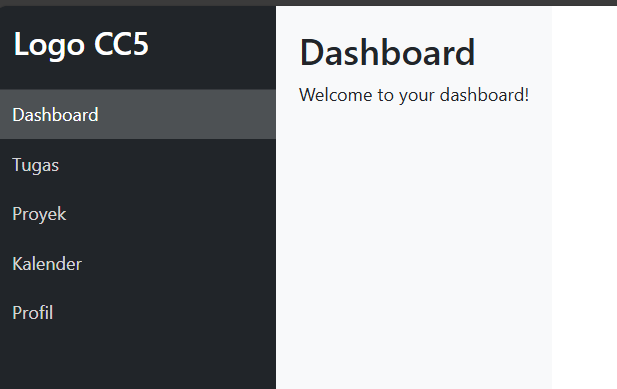
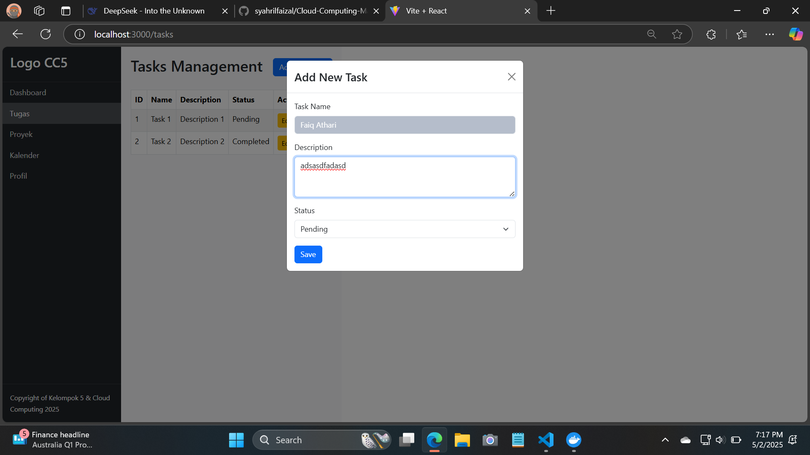

## 📄 Laporan Week 12

### 👥 Anggota Tim
1. **Muhammad Syahril Faizal** – 10221035
2. **Hardi Wira Pratama** - 10221049
3. **Faiq Athari** - 10221052

<br>

# Penjelasan Konfigurasi docker-compose.yml

## 1. Konfigurasi `docker-compose.yml`
```yml
services:
  # Layanan backend menggunakan framework Flask
  backend:
    build:
      context: ./backend  # Path ke Dockerfile Flask yang berada di folder ./backend
    container_name: flask_container  # Nama container untuk mempermudah pengelolaan
    ports:
      - "5000:5000"  # Memetakan port 5000 di host ke port 5000 di container Flask
    depends_on:
      - db  # Menunggu service db (PostgreSQL) siap sebelum memulai Flask
    environment:
      - DB_HOST=db  # Nama service PostgreSQL yang akan diresolve oleh Docker ke IP container
      - DB_NAME=task_db  # Nama database yang digunakan oleh Flask
      - DB_USER=username  # Username database
      - DB_PASSWORD=password  # Password database

  # Layanan database menggunakan PostgreSQL versi ringan (alpine)
  db:
    image: postgres:12-alpine  # Menggunakan image resmi PostgreSQL versi 12 berbasis Alpine
    container_name: postgres_container  # Nama container PostgreSQL
    environment:
      - POSTGRES_DB=task_db  # Nama database yang akan dibuat saat container pertama kali dijalankan
      - POSTGRES_USER=username  # Username default untuk akses ke database
      - POSTGRES_PASSWORD=password  # Password default
    ports:
      - "5432:5432"  # Memetakan port PostgreSQL default di host ke container

    volumes:
      - db_data:/var/lib/postgresql/data  # Volume untuk menyimpan data PostgreSQL agar tidak hilang saat container dimatikan
      - ./backend/db/schema.sql:/docker-entrypoint-initdb.d/schema.sql  # File SQL akan dijalankan otomatis saat pertama kali container db dibuat

# Definisi volume untuk persistent storage database
volumes:
  db_data:
```
## Penjelasan
1. Backend Service (Flask API) <br>
Menggunakan Flask untuk menyediakan API yang terhubung ke database PostgreSQL.
depends_on: Memastikan database siap sebelum backend dijalankan.
Menggunakan variabel lingkungan (DB_HOST, DB_NAME, dll) untuk koneksi ke database.

2. Database Service (PostgreSQL) <br>
Menggunakan image postgres:12-alpine untuk menjalankan PostgreSQL.
Port 5432 digunakan untuk koneksi database dari backend.
Menggunakan volume untuk menyimpan data secara permanen dan mengeksekusi schema.sql saat pertama kali dijalankan.

3. Volume <br>
db_data: Menyimpan data PostgreSQL secara persisten di luar container.  

## Proses Build Docker Containers


## Tampilan pada Docker Dekstop


## Web dan Microservices

### 1. Tampilan Dashboard dari aplikasi Management Task   


## 2. Layanan untuk menambahkan Tasks baru dengan mengisi nama dan deskripsi serta status


## 3. Tasks yang sudah ditampilkan akan dimunculkan di halaman ini


