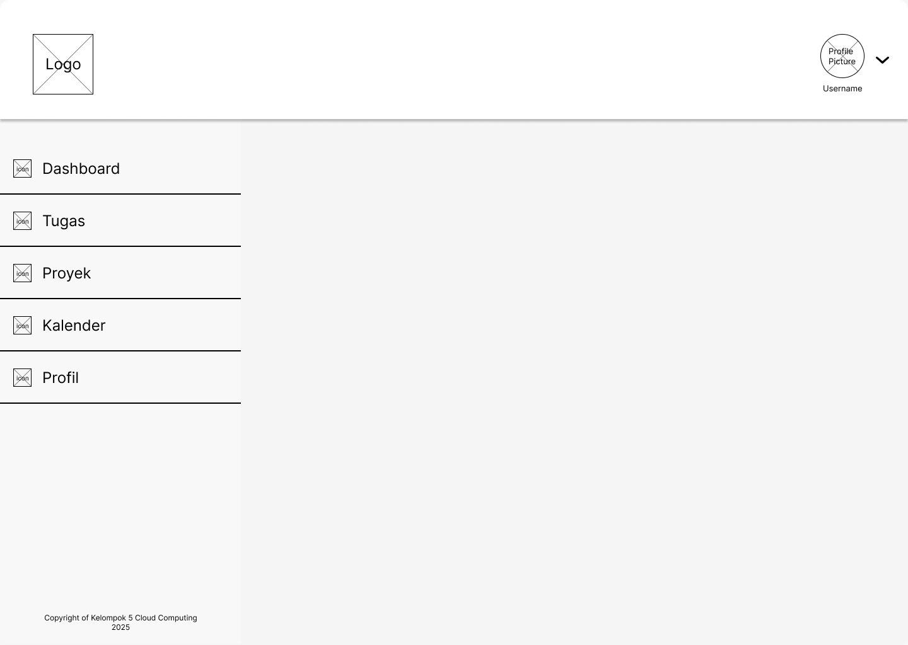

## 📄 Proposal Proyek: Platform Manajemen Tugas dan Kolaborasi Tim

### 👥 Anggota Tim
1. **Muhammad Syahril Faizal** – 10221035
2. **Hardi Wira Pratama** - 10221049
3. **Faiq Athari** - 10221052

---

### Deskripsi Proyek

Proyek ini bertujuan untuk mengembangkan sebuah Platform Manajemen Tugas dan Kolaborasi Tim yang dapat membantu tim dalam mengelola tugas, membagi tanggung jawab, dan melacak progres proyek secara efektif. Aplikasi ini akan dirancang untuk mendukung kolaborasi antara anggota tim dengan menyediakan fitur-fitur seperti pembuatan dan pengelolaan tugas, penjadwalan, dan pelaporan progres. Platform ini akan menggunakan teknologi React JS untuk antarmuka pengguna (frontend), Flask untuk pengelolaan logika aplikasi dan API (backend), serta Docker untuk kemudahan deployment dan skalabilitas. Tujuan utama dari aplikasi ini adalah untuk meningkatkan produktivitas tim, mengurangi kesalahan komunikasi, dan memastikan setiap tugas terlaksana dengan baik dan tepat waktu.


---

### Scope

- Pembuatan Tugas: Pengguna dapat membuat dan mendefinisikan tugas dengan detail seperti nama tugas, deskripsi, tanggal jatuh tempo, dan prioritas.
- Penugasan Tugas: Pengguna dapat menugaskan tugas kepada anggota tim tertentu.
- Pelacakan Progres Tugas: Pengguna dapat melacak status tugas, termasuk mengubah status menjadi "Selesai", "Dalam Proses", atau "Tertunda".
- Kolaborasi dan Komentar: Anggota tim dapat menambahkan komentar di dalam setiap tugas.
- Pengelolaan Proyek: Pengguna dapat mengelompokkan tugas dalam proyek dan melacak kemajuan proyek secara keseluruhan.
- Integrasi Kalender: Pengguna dapat melihat tugas yang dijadwalkan pada tampilan kalender.

---

### 📅 Timeline Pengerjaan

| Pekan |	Aktivitas |
|-------|-----------|
| 9 |	Penyusunan rancangan awal serta inisiasi struktur proyek |
| 10 | Pengembangan layanan backend berbasis microservices |
| 11 |	Implementasi antarmuka pengguna (frontend) |
| 12 |	Integrasi antar layanan dan konfigurasi Docker Compose |
| 13 |	Penyiapan pipeline CI/CD dan proses deployment ke cloud |
| 14 |	Implementasi sistem monitoring, pencatatan log, serta optimasi skalabilitas |
| 15 |	Penyempurnaan proyek secara keseluruhan dan Presentasi akhir |

---

### 🧑‍🔧 Pembagian Tugas

| Nama | Tugas |
|------|-------|
| Muhammad Syahril Faizal | Backend Development, Docker |
| Hardi Wira Pratama | DevOps/Infrastructure Engineer  |
| Faiq Athari | Frontend Engineer, React+Vite |

---

### 🧱 Arsitektur Microservices

```

+---------------------------------------------------------+
|                      API Gateway                       |
+---------------------+-----------------------+-----------+
|       Auth          |       Task            |   User    |
|     Service         |     Service           |  Service  |
+---------------------+-----------------------+-----------+
|       Project       |    Calendar                       |        
|     Service         |     Service                       |           
+---------------------+-----------------------+-----------+
                               |
         +-------------------------+------------------+
         |         		       Database               |
         |-------------------------|------------------|
         |   	       PostgreSQL (Main DB)  	      |
         +-------------------------+------------------+


```

#### Deskripsi Singkat Microservices:
- **API Gateway**: Mengelola routing, autentikasi, dan load balancing.
- **Auth Service**: Menangani login, registrasi, dan pengelolaan token autentikasi.
- **Task Service**: Pembuatan tugas, pembaruan status, dan penugasan anggota tim.
- **User Service**: Mengelola profil pengguna dan peran tugas.
- **Project Service**: Mengelola proyek dan mengelompokkan tugas.
- **Calendar Service**: Menyediakan tampilan kalender untuk tugas yang - dijadwalkan.
- **Database**: Menyimpan data tugas, proyek, dan pengguna, dengan RabbitMQ/Kafka untuk komunikasi antar layanan.
---

### 🖼️ Wireframe UI/UX



## 1. Header (Bagian Atas)
- **Navigasi Atas**:
  - **Logo (kiri)**: Menampilkan identitas aplikasi.
  - **Ikon Profil Pengguna (kanan)**: Menampilkan pengaturan akun dan opsi keluar (logout).

## 2. Sidebar (Sidebar Kiri)
- **Dashboard**: Ringkasan tugas dan proyek.
- **Tugas**: Daftar dan manajemen tugas.
- **Proyek**: Membuat dan mengelola proyek.
- **Kalender**: Menampilkan jadwal tugas.
- **Profil**: Mengatur profil pengguna.

## 3. Area Konten Utama
- **Tampilan Daftar Tugas**:
  - **Kolom**: Nama Tugas, Deskripsi, Tanggal Jatuh Tempo, Prioritas, Status (misalnya "Sedang Dikerjakan", "Selesai", "Tertunda").
  - **Tombol Filter**: Menyaring tugas berdasarkan status, prioritas, atau tenggat waktu.
  - **Tombol Urutkan**: Mengurutkan tugas berdasarkan prioritas, tanggal, atau status.
  - **Tombol Buat Tugas Baru**: Menambah tugas baru.
  - **Aksi pada Baris Tugas**: Edit, ubah status, atau hapus tugas.
  
- **Bagian Ringkasan Proyek**:
  - Daftar proyek yang sedang berjalan.
  - **Progress Bar**: Menampilkan progres proyek.
  - **Tombol Buat Proyek Baru**: Membuat proyek baru.

- **Tampilan Kalender**:
  - Tampilan **Bulanan/Mingguan** untuk tugas yang dijadwalkan.
  - Setiap tugas bisa diklik untuk detail lebih lanjut atau edit.

## 4. Modal Pembuatan Tugas
- **Nama Tugas**: Kolom untuk nama tugas.
- **Deskripsi**: Kolom untuk deskripsi tugas.
- **Tanggal Jatuh Tempo**: Pilihan memilih tanggal.
- **Prioritas**: Dropdown untuk memilih prioritas (Rendah, Sedang, Tinggi).
- **Penugasan**: Menugaskan tugas kepada anggota tim.
- **Tombol Simpan dan Batal**: Menyimpan atau membatalkan pembuatan tugas.

## 5. Halaman Detail Tugas
- **Informasi Tugas**: Nama, deskripsi, prioritas, tenggat waktu.
- **Bagian Komentar**: Area untuk diskusi atau umpan balik.
- **Dropdown Status**: Mengubah status tugas (misalnya "Sedang Dikerjakan", "Selesai", "Tertunda").
- **Lampiran File**: Mengunggah file yang berkaitan dengan tugas.


---

### 📁 Struktur Awal Repository GitHub

```
/taskhub-platform/
├── README.md                     # Deskripsi umum proyek dan cara penggunaan awal
├── docker-compose.yml            # Konfigurasi awal untuk menjalankan semua layanan menggunakan Docker
├── docs/
│   └── proposal.md               # Dokumen proposal atau perencanaan awal sistem
├── backend/
│   └── services/
│       ├── auth-service/         # Layanan untuk autentikasi dan otorisasi pengguna
│       ├── task-service/         # Layanan untuk manajemen tugas (CRUD tugas, status, deadline)
│       └── project-service/      # Layanan untuk manajemen proyek dan anggota tim
├── frontend/                     # Source code antarmuka pengguna (web client)
├── db/
│   └── init.sql
